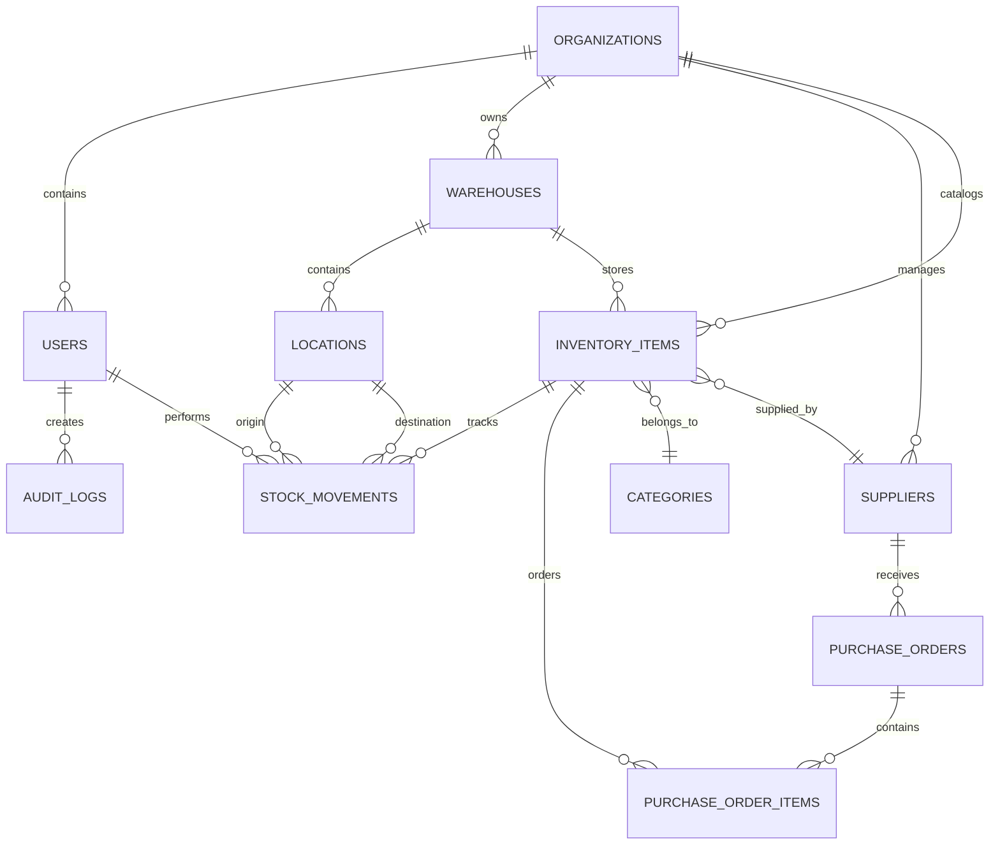

# LogiVox - Technical Design Document

## 1. Design Overview

This document provides comprehensive technical design specifications for LogiVox's next-generation platform, covering enterprise-grade UI/UX design, intelligent database architecture, advanced API specifications, AI/ML integration patterns, and future-proof system design.

## 2. Next-Generation UI/UX Design System

### 2.1 Design Philosophy & Principles

#### 2.1.1 Core Design Philosophy

- **Intelligence-First**: AI-powered interfaces that anticipate user needs
- **Universal Accessibility**: WCAG 2.1 AAA compliance with voice commands and keyboard navigation
- **Adaptive Experience**: Dynamic interfaces that learn from user behavior
- **Performance Obsessed**: Sub-second load times with optimistic UI updates
- **Offline-Native**: Complete functionality without internet connectivity

#### 2.1.2 Enterprise User Experience Goals

- **Zero Learning Curve**: Contextual onboarding with interactive tutorials
- **Predictive Interface**: AI suggestions before users need them
- **Multi-Modal Input**: Touch, voice, barcode scanning, gesture recognition
- **Cross-Platform Consistency**: Identical experience on web, mobile, and tablet
- **Real-Time Collaboration**: Live updates and concurrent user awareness

#### 2.1.3 Industry-Specific Adaptations

- **Automotive**: VIN scanning, parts catalogs, compliance tracking
- **Healthcare**: Serial number tracking, expiry management, regulatory compliance
- **Manufacturing**: Bill of materials, quality checkpoints, maintenance schedules
- **Retail**: SKU management, seasonal planning, multi-channel inventory

### 2.2 Advanced Design System

#### 2.2.1 Intelligent Color System

```css
:root {
  /* Dynamic Brand Colors (AI-adjusted based on industry) */
  --brand-primary-50: #eff6ff;
  --brand-primary-100: #dbeafe;
  --brand-primary-500: #3b82f6; /* LogiVox Blue */
  --brand-primary-600: #2563eb;
  --brand-primary-900: #1e3a8a;

  /* Contextual Colors (change based on workflow state) */
  --context-receiving: #10b981; /* Green for inbound */
  --context-dispatching: #f59e0b; /* Orange for outbound */
  --context-quality: #8b5cf6; /* Purple for QC */
  --context-error: #ef4444; /* Red for errors */

  /* Semantic Status Colors */
  --status-success: #10b981; /* Completed operations */
  --status-warning: #f59e0b; /* Attention required */
  --status-error: #ef4444; /* Failed operations */
  --status-info: #3b82f6; /* Information display */
  --status-pending: #6b7280; /* In progress */

  /* Intelligent Contrast (adapts to lighting conditions) */
  --surface-primary: #ffffff; /* Main background */
  --surface-secondary: #f9fafb; /* Card backgrounds */
  --surface-tertiary: #f3f4f6; /* Input backgrounds */
  --text-primary: #111827; /* Primary text */
  --text-secondary: #6b7280; /* Secondary text */
  --text-tertiary: #9ca3af; /* Tertiary text */

  /* White-Label Customization Variables */
  --custom-primary: var(--brand-primary-500);
  --custom-logo-filter: none;
  --custom-accent: var(--context-receiving);
}

/* Dark Mode Support */
@media (prefers-color-scheme: dark) {
  :root {
    --surface-primary: #111827;
    --surface-secondary: #1f2937;
    --surface-tertiary: #374151;
    --text-primary: #f9fafb;
    --text-secondary: #d1d5db;
    --text-tertiary: #9ca3af;
  }
}

/* High Contrast Mode for Warehouse Environments */
@media (prefers-contrast: high) {
  :root {
    --brand-primary-500: #000080;
    --text-primary: #000000;
    --surface-primary: #ffffff;
  }
}
```

#### 2.2.2 Responsive Typography System

```css
/* Fluid Typography with Industry-Specific Scaling */
:root {
  /* Warehouse-Optimized Font Sizes (larger for mobile scanning) */
  --text-xs: clamp(0.75rem, 0.7rem + 0.25vw, 1rem); /* 12-16px */
  --text-sm: clamp(0.875rem, 0.8rem + 0.375vw, 1.125rem); /* 14-18px */
  --text-base: clamp(1rem, 0.9rem + 0.5vw, 1.25rem); /* 16-20px */
  --text-lg: clamp(1.125rem, 1rem + 0.625vw, 1.5rem); /* 18-24px */
  --text-xl: clamp(1.25rem, 1.1rem + 0.75vw, 1.875rem); /* 20-30px */
  --text-2xl: clamp(1.5rem, 1.3rem + 1vw, 2.25rem); /* 24-36px */
  --text-3xl: clamp(1.875rem, 1.6rem + 1.375vw, 3rem); /* 30-48px */

  /* Font Families */
  --font-sans: "Inter", system-ui, sans-serif;
  --font-mono: "JetBrains Mono", "Courier New", monospace;
  --font-display: "Cal Sans", "Inter", sans-serif;

  /* Font Weights */
  --font-thin: 100;
  --font-light: 300;
  --font-normal: 400;
  --font-medium: 500;
  --font-semibold: 600;
  --font-bold: 700;
  --font-black: 900;

  /* Line Heights for Readability */
  --leading-none: 1;
  --leading-tight: 1.25;
  --leading-snug: 1.375;
  --leading-normal: 1.5;
  --leading-relaxed: 1.625;
  --leading-loose: 2;
}
```

#### 2.2.3 Advanced Component Library

```typescript
// Component Architecture with AI Integration
interface LogiVoxComponentProps {
  // AI-powered props
  aiSuggestions?: boolean;
  predictiveText?: boolean;
  voiceEnabled?: boolean;

  // Accessibility props
  ariaLabel?: string;
  screenReaderText?: string;
  keyboardShortcut?: string;

  // Industry customization
  industry?: "automotive" | "healthcare" | "manufacturing" | "retail";
  workflowContext?: "receiving" | "dispatching" | "quality" | "returns";

  // Multi-tenant props
  tenantId?: string;
  customTheme?: CustomTheme;
  whiteLabel?: boolean;
}

// Smart Input Component with AI Suggestions
interface SmartInputProps extends LogiVoxComponentProps {
  type: "text" | "number" | "barcode" | "sku" | "po-number";
  aiComplete?: boolean; // Enable AI autocomplete
  historicalData?: boolean; // Use historical data for suggestions
  validationRules?: ValidationRule[];
  barcodeScanning?: boolean; // Enable camera scanning
  voiceInput?: boolean; // Enable voice-to-text
  offlineSync?: boolean; // Enable offline caching
}

// Advanced Table Component with Real-time Updates
interface SmartTableProps extends LogiVoxComponentProps {
  data: TableData[];
  columns: SmartTableColumn[];
  realTimeUpdates?: boolean; // WebSocket updates
  virtualScrolling?: boolean; // Handle large datasets
  exportFormats?: ("csv" | "excel" | "pdf")[];
  aiInsights?: boolean; // Show AI-powered insights
  predictiveSort?: boolean; // AI-predicted sort preferences
}

// Intelligent Dashboard Component
interface SmartDashboardProps extends LogiVoxComponentProps {
  widgets: DashboardWidget[];
  aiRecommendations?: boolean; // Show AI recommendations
  anomalyDetection?: boolean; // Highlight unusual patterns
  predictiveAlerts?: boolean; // Forecast-based alerts
  customizable?: boolean; // User-customizable layout
  multiTenant?: boolean; // Support white-label branding
}
```

--gray-800: #1f2937;
--gray-900: #111827;
}

````

#### 2.2.2 Typography Scale
```css
/* Font Family */
--font-family: 'Inter', system-ui, sans-serif;

/* Font Sizes */
--text-xs: 0.75rem;     /* 12px */
--text-sm: 0.875rem;    /* 14px */
--text-base: 1rem;      /* 16px */
--text-lg: 1.125rem;    /* 18px */
--text-xl: 1.25rem;     /* 20px */
--text-2xl: 1.5rem;     /* 24px */
--text-3xl: 1.875rem;   /* 30px */
--text-4xl: 2.25rem;    /* 36px */

/* Font Weights */
--font-normal: 400;
--font-medium: 500;
--font-semibold: 600;
--font-bold: 700;

/* Line Heights */
--leading-tight: 1.25;
--leading-normal: 1.5;
--leading-relaxed: 1.625;
````

#### 2.2.3 Spacing System

```css
/* Spacing Scale (4px base unit) */
--space-1: 0.25rem; /* 4px */
--space-2: 0.5rem; /* 8px */
--space-3: 0.75rem; /* 12px */
--space-4: 1rem; /* 16px */
--space-5: 1.25rem; /* 20px */
--space-6: 1.5rem; /* 24px */
--space-8: 2rem; /* 32px */
--space-10: 2.5rem; /* 40px */
--space-12: 3rem; /* 48px */
--space-16: 4rem; /* 64px */
```

#### 2.2.4 Component Library

```typescript
// Button Component Variants
interface ButtonProps {
  variant: "primary" | "secondary" | "outline" | "ghost" | "danger";
  size: "sm" | "md" | "lg";
  loading?: boolean;
  disabled?: boolean;
  icon?: ReactNode;
  children: ReactNode;
}

// Input Component Variants
interface InputProps {
  type: "text" | "email" | "password" | "number" | "search";
  size: "sm" | "md" | "lg";
  status: "default" | "error" | "success" | "warning";
  prefix?: ReactNode;
  suffix?: ReactNode;
  label?: string;
  helpText?: string;
  required?: boolean;
}

// Card Component
interface CardProps {
  variant: "default" | "outlined" | "elevated";
  padding: "none" | "sm" | "md" | "lg";
  header?: ReactNode;
  footer?: ReactNode;
  children: ReactNode;
}
```

### 2.3 Screen Layouts

#### 2.3.1 Desktop Layout Structure

```
┌─────────────────────────────────────────────────────────┐
│ Header (Navigation, User Menu, Notifications)          │
├─────────────────────────────────────────────────────────┤
│ Sidebar │                Main Content                   │
│ - Nav   │ ┌─────────────────────────────────────────┐   │
│ - Menu  │ │ Page Header (Title, Actions, Breadcrumb│   │
│ - Quick │ ├─────────────────────────────────────────┤   │
│   Actions│ │                                         │   │
│         │ │        Content Area                     │   │
│         │ │                                         │   │
│         │ │                                         │   │
│         │ └─────────────────────────────────────────┘   │
├─────────────────────────────────────────────────────────┤
│ Footer (Status, Version, Links)                        │
└─────────────────────────────────────────────────────────┘
```

#### 2.3.2 Mobile Layout Structure

```
┌─────────────────────┐
│ Header              │
│ ┌─────┐ ┌─────────┐ │
│ │Menu │ │ Actions │ │
│ └─────┘ └─────────┘ │
├─────────────────────┤
│                     │
│   Content Area      │
│                     │
│                     │
│                     │
│                     │
├─────────────────────┤
│ Bottom Navigation   │
│ [Home][Scan][More]  │
└─────────────────────┘
```

## 3. Database Design

### 3.1 Entity Relationship Diagram



### 3.2 Core Tables Schema

#### 3.2.1 Organizations Table

```sql
CREATE TABLE organizations (
    id UUID PRIMARY KEY DEFAULT gen_random_uuid(),
    name VARCHAR(100) NOT NULL,
    domain VARCHAR(100) UNIQUE NOT NULL,
    plan subscription_plan NOT NULL DEFAULT 'FREE',
    settings JSONB NOT NULL DEFAULT '{}',
    billing_info JSONB,
    is_active BOOLEAN DEFAULT TRUE,
    created_at TIMESTAMP WITH TIME ZONE DEFAULT NOW(),
    updated_at TIMESTAMP WITH TIME ZONE DEFAULT NOW(),

    -- Constraints
    CONSTRAINT org_name_not_empty CHECK (LENGTH(TRIM(name)) > 0),
    CONSTRAINT org_domain_format CHECK (domain ~ '^[a-z0-9\-]+$')
);

-- Indexes
CREATE INDEX idx_organizations_domain ON organizations(domain);
CREATE INDEX idx_organizations_active ON organizations(is_active) WHERE is_active = TRUE;
```

#### 3.2.2 Users Table

```sql
CREATE TABLE users (
    id UUID PRIMARY KEY DEFAULT gen_random_uuid(),
    organization_id UUID NOT NULL REFERENCES organizations(id) ON DELETE CASCADE,
    email VARCHAR(255) UNIQUE NOT NULL,
    first_name VARCHAR(100) NOT NULL,
    last_name VARCHAR(100) NOT NULL,
    password_hash VARCHAR(255) NOT NULL,
    role user_role NOT NULL DEFAULT 'VIEWER',
    permissions TEXT[] DEFAULT '{}',
    phone VARCHAR(20),
    avatar_url TEXT,
    last_login_at TIMESTAMP WITH TIME ZONE,
    is_active BOOLEAN DEFAULT TRUE,
    email_verified BOOLEAN DEFAULT FALSE,
    mfa_enabled BOOLEAN DEFAULT FALSE,
    mfa_secret VARCHAR(32),
    created_at TIMESTAMP WITH TIME ZONE DEFAULT NOW(),
    updated_at TIMESTAMP WITH TIME ZONE DEFAULT NOW(),

    -- Constraints
    CONSTRAINT user_email_format CHECK (email ~ '^[^@]+@[^@]+\.[^@]+$'),
    CONSTRAINT user_name_not_empty CHECK (
        LENGTH(TRIM(first_name)) > 0 AND LENGTH(TRIM(last_name)) > 0
    )
);

-- Indexes
CREATE INDEX idx_users_organization ON users(organization_id);
CREATE INDEX idx_users_email ON users(email);
CREATE INDEX idx_users_active ON users(organization_id, is_active) WHERE is_active = TRUE;
CREATE INDEX idx_users_role ON users(organization_id, role);
```

#### 3.2.3 Inventory Items Table

```sql
CREATE TABLE inventory_items (
    id UUID PRIMARY KEY DEFAULT gen_random_uuid(),
    organization_id UUID NOT NULL REFERENCES organizations(id) ON DELETE CASCADE,
    warehouse_id UUID NOT NULL REFERENCES warehouses(id) ON DELETE CASCADE,
    category_id UUID REFERENCES categories(id) ON DELETE SET NULL,
    supplier_id UUID REFERENCES suppliers(id) ON DELETE SET NULL,

    -- Item identification
    sku VARCHAR(100) NOT NULL,
    name VARCHAR(255) NOT NULL,
    description TEXT,
    barcode VARCHAR(50),

    -- Pricing
    unit_price DECIMAL(10,2) NOT NULL CHECK (unit_price >= 0),
    currency VARCHAR(3) DEFAULT 'USD',

    -- Stock tracking
    current_stock INTEGER NOT NULL DEFAULT 0 CHECK (current_stock >= 0),
    min_stock INTEGER DEFAULT 0 CHECK (min_stock >= 0),
    max_stock INTEGER CHECK (max_stock IS NULL OR max_stock >= min_stock),
    reorder_point INTEGER DEFAULT 0 CHECK (reorder_point >= 0),

    -- Physical properties
    weight_kg DECIMAL(8,3),
    dimensions JSONB, -- {length, width, height, unit}

    -- Settings
    is_active BOOLEAN DEFAULT TRUE,
    track_serial_numbers BOOLEAN DEFAULT FALSE,
    allow_negative_stock BOOLEAN DEFAULT FALSE,

    created_at TIMESTAMP WITH TIME ZONE DEFAULT NOW(),
    updated_at TIMESTAMP WITH TIME ZONE DEFAULT NOW(),
    created_by UUID NOT NULL REFERENCES users(id),

    -- Constraints
    CONSTRAINT inventory_sku_org_unique UNIQUE (organization_id, sku),
    CONSTRAINT inventory_barcode_org_unique UNIQUE (organization_id, barcode),
    CONSTRAINT inventory_name_not_empty CHECK (LENGTH(TRIM(name)) > 0)
);

-- Indexes
CREATE INDEX idx_inventory_organization ON inventory_items(organization_id);
CREATE INDEX idx_inventory_warehouse ON inventory_items(warehouse_id);
CREATE INDEX idx_inventory_sku ON inventory_items(organization_id, sku);
CREATE INDEX idx_inventory_barcode ON inventory_items(organization_id, barcode)
    WHERE barcode IS NOT NULL;
CREATE INDEX idx_inventory_category ON inventory_items(category_id);
CREATE INDEX idx_inventory_supplier ON inventory_items(supplier_id);
CREATE INDEX idx_inventory_low_stock ON inventory_items(organization_id, warehouse_id)
    WHERE current_stock <= reorder_point;
```

#### 3.2.4 Stock Movements Table

```sql
CREATE TABLE stock_movements (
    id UUID PRIMARY KEY DEFAULT gen_random_uuid(),
    organization_id UUID NOT NULL REFERENCES organizations(id) ON DELETE CASCADE,
    inventory_item_id UUID NOT NULL REFERENCES inventory_items(id) ON DELETE CASCADE,

    -- Movement details
    movement_type stock_movement_type NOT NULL,
    quantity INTEGER NOT NULL,
    unit_cost DECIMAL(10,2),
    total_cost DECIMAL(10,2),

    -- Location information
    from_location_id UUID REFERENCES locations(id),
    to_location_id UUID REFERENCES locations(id),
    from_warehouse_id UUID REFERENCES warehouses(id),
    to_warehouse_id UUID REFERENCES warehouses(id),

    -- Reference documents
    reference_type reference_document_type,
    reference_id UUID,
    reference_number VARCHAR(100),

    -- Additional information
    notes TEXT,
    serial_numbers TEXT[], -- For serialized items
    batch_number VARCHAR(50),
    expiry_date DATE,

    -- Audit information
    created_at TIMESTAMP WITH TIME ZONE DEFAULT NOW(),
    created_by UUID NOT NULL REFERENCES users(id),

    -- Constraints
    CONSTRAINT movement_quantity_not_zero CHECK (quantity != 0),
    CONSTRAINT movement_costs_positive CHECK (
        unit_cost IS NULL OR unit_cost >= 0
    ),
    CONSTRAINT movement_location_logic CHECK (
        CASE
            WHEN movement_type IN ('INBOUND', 'ADJUSTMENT', 'FOUND') THEN
                to_location_id IS NOT NULL
            WHEN movement_type IN ('OUTBOUND', 'SHRINKAGE', 'THEFT') THEN
                from_location_id IS NOT NULL
            WHEN movement_type = 'TRANSFER' THEN
                from_location_id IS NOT NULL AND to_location_id IS NOT NULL
            ELSE TRUE
        END
    )
);

-- Indexes
CREATE INDEX idx_stock_movements_organization ON stock_movements(organization_id);
CREATE INDEX idx_stock_movements_item ON stock_movements(inventory_item_id);
CREATE INDEX idx_stock_movements_date ON stock_movements(created_at DESC);
CREATE INDEX idx_stock_movements_type ON stock_movements(movement_type);
CREATE INDEX idx_stock_movements_reference ON stock_movements(reference_type, reference_id);
CREATE INDEX idx_stock_movements_item_date ON stock_movements(inventory_item_id, created_at DESC);
```

### 3.3 Enumeration Types

#### 3.3.1 User Roles and Permissions

```sql
-- User roles
CREATE TYPE user_role AS ENUM (
    'SUPER_ADMIN',
    'ADMIN',
    'MANAGER',
    'OPERATOR',
    'VIEWER'
);

-- Subscription plans
CREATE TYPE subscription_plan AS ENUM (
    'FREE',
    'STARTER',
    'PROFESSIONAL',
    'ENTERPRISE'
);
```

#### 3.3.2 Stock Movement Types

```sql
-- Stock movement types
CREATE TYPE stock_movement_type AS ENUM (
    'INBOUND',      -- Receiving inventory
    'OUTBOUND',     -- Shipping inventory
    'TRANSFER',     -- Moving between locations
    'ADJUSTMENT',   -- Stock count adjustments
    'SHRINKAGE',    -- Loss due to damage/theft
    'FOUND',        -- Found inventory
    'CORRECTION',   -- Error corrections
    'THEFT',        -- Reported theft
    'OTHER'         -- Other movements
);

-- Reference document types
CREATE TYPE reference_document_type AS ENUM (
    'PURCHASE_ORDER',
    'SALES_ORDER',
    'TRANSFER_ORDER',
    'ADJUSTMENT',
    'PHYSICAL_COUNT',
    'RETURN',
    'OTHER'
);
```

### 3.4 Database Functions and Triggers

#### 3.4.1 Stock Level Update Trigger

```sql
-- Function to update stock levels
CREATE OR REPLACE FUNCTION update_stock_levels()
RETURNS TRIGGER AS $$
BEGIN
    -- Update current stock based on movement
    IF NEW.movement_type IN ('INBOUND', 'FOUND', 'CORRECTION') THEN
        UPDATE inventory_items
        SET current_stock = current_stock + NEW.quantity,
            updated_at = NOW()
        WHERE id = NEW.inventory_item_id;
    ELSIF NEW.movement_type IN ('OUTBOUND', 'SHRINKAGE', 'THEFT') THEN
        UPDATE inventory_items
        SET current_stock = current_stock - ABS(NEW.quantity),
            updated_at = NOW()
        WHERE id = NEW.inventory_item_id;
    ELSIF NEW.movement_type = 'ADJUSTMENT' THEN
        UPDATE inventory_items
        SET current_stock = current_stock + NEW.quantity,
            updated_at = NOW()
        WHERE id = NEW.inventory_item_id;
    END IF;

    RETURN NEW;
END;
$$ LANGUAGE plpgsql;

-- Create trigger
CREATE TRIGGER trigger_update_stock_levels
    AFTER INSERT ON stock_movements
    FOR EACH ROW
    EXECUTE FUNCTION update_stock_levels();
```

#### 3.4.2 Audit Log Function

```sql
-- Function to create audit logs
CREATE OR REPLACE FUNCTION create_audit_log()
RETURNS TRIGGER AS $$
BEGIN
    INSERT INTO audit_logs (
        organization_id,
        table_name,
        record_id,
        action,
        old_values,
        new_values,
        user_id,
        created_at
    ) VALUES (
        COALESCE(NEW.organization_id, OLD.organization_id),
        TG_TABLE_NAME,
        COALESCE(NEW.id, OLD.id),
        TG_OP,
        CASE WHEN TG_OP = 'DELETE' THEN to_jsonb(OLD) ELSE NULL END,
        CASE WHEN TG_OP IN ('INSERT', 'UPDATE') THEN to_jsonb(NEW) ELSE NULL END,
        current_setting('app.current_user_id', true)::UUID,
        NOW()
    );

    RETURN COALESCE(NEW, OLD);
END;
$$ LANGUAGE plpgsql;

-- Apply audit trigger to all main tables
CREATE TRIGGER audit_inventory_items
    AFTER INSERT OR UPDATE OR DELETE ON inventory_items
    FOR EACH ROW EXECUTE FUNCTION create_audit_log();

CREATE TRIGGER audit_stock_movements
    AFTER INSERT OR UPDATE OR DELETE ON stock_movements
    FOR EACH ROW EXECUTE FUNCTION create_audit_log();
```

## 4. API Design Specifications

### 4.1 RESTful API Standards

#### 4.1.1 API Versioning and Base Structure

```
Base URL: https://api.logivox.ai/v1/
Authentication: Bearer {jwt_token}
Content-Type: application/json
```

#### 4.1.2 HTTP Status Codes

```
200 OK - Successful GET, PUT, PATCH
201 Created - Successful POST
204 No Content - Successful DELETE
400 Bad Request - Invalid request data
401 Unauthorized - Missing or invalid authentication
403 Forbidden - Insufficient permissions
404 Not Found - Resource not found
409 Conflict - Resource conflict (duplicate)
422 Unprocessable Entity - Validation errors
429 Too Many Requests - Rate limit exceeded
500 Internal Server Error - Server error
503 Service Unavailable - Temporary outage
```

#### 4.1.3 Standard Response Format

```typescript
// Success Response
interface ApiResponse<T> {
  success: true;
  data: T;
  message?: string;
  meta?: {
    pagination?: PaginationMeta;
    filters?: FilterMeta;
    timing?: number;
  };
}

// Error Response
interface ErrorResponse {
  success: false;
  error: string;
  details?: {
    field?: string;
    code?: string;
    validation?: ValidationError[];
  };
  trace_id?: string;
}

// Pagination Meta
interface PaginationMeta {
  page: number;
  pageSize: number;
  total: number;
  totalPages: number;
  hasNext: boolean;
  hasPrev: boolean;
}
```

### 4.2 Core API Endpoints

#### 4.2.1 Authentication Endpoints

```typescript
// POST /auth/login
interface LoginRequest {
  email: string;
  password: string;
  organizationDomain?: string;
}

interface LoginResponse {
  user: User;
  tokens: {
    accessToken: string;
    refreshToken: string;
    expiresIn: number;
  };
  organization: Organization;
}

// POST /auth/refresh
interface RefreshRequest {
  refreshToken: string;
}

// POST /auth/logout
interface LogoutRequest {
  refreshToken: string;
}

// POST /auth/forgot-password
interface ForgotPasswordRequest {
  email: string;
  organizationDomain: string;
}

// POST /auth/reset-password
interface ResetPasswordRequest {
  token: string;
  password: string;
}
```

#### 4.2.2 Inventory Management Endpoints

```typescript
// GET /inventory/items
interface GetInventoryItemsQuery {
  page?: number;
  pageSize?: number;
  warehouseId?: string;
  categoryId?: string;
  supplierId?: string;
  search?: string;
  lowStock?: boolean;
  sortBy?: "name" | "sku" | "currentStock" | "updatedAt";
  sortOrder?: "asc" | "desc";
}

// POST /inventory/items
interface CreateInventoryItemRequest {
  sku: string;
  name: string;
  description?: string;
  warehouseId: string;
  categoryId?: string;
  supplierId?: string;
  unitPrice: number;
  currency: string;
  currentStock: number;
  minStock?: number;
  maxStock?: number;
  reorderPoint?: number;
  barcode?: string;
  dimensions?: ProductDimensions;
  trackSerialNumbers?: boolean;
}

// PUT /inventory/items/:id
interface UpdateInventoryItemRequest
  extends Partial<CreateInventoryItemRequest> {
  id: string;
}

// POST /inventory/items/:id/adjust-stock
interface StockAdjustmentRequest {
  quantity: number; // Positive or negative
  reason: AdjustmentReason;
  notes?: string;
  locationId?: string;
  unitCost?: number;
}

// POST /inventory/items/:id/move
interface StockMoveRequest {
  fromLocationId: string;
  toLocationId: string;
  quantity: number;
  notes?: string;
}

// GET /inventory/movements
interface GetStockMovementsQuery {
  page?: number;
  pageSize?: number;
  itemId?: string;
  warehouseId?: string;
  movementType?: StockMovementType;
  dateFrom?: string;
  dateTo?: string;
  createdBy?: string;
}
```

#### 4.2.3 Warehouse Management Endpoints

```typescript
// GET /warehouses
interface GetWarehousesResponse {
  warehouses: Warehouse[];
}

// POST /warehouses
interface CreateWarehouseRequest {
  name: string;
  code: string;
  address: Address;
  isActive?: boolean;
  settings?: WarehouseSettings;
}

// GET /warehouses/:id/locations
interface GetLocationsQuery {
  warehouseId: string;
  page?: number;
  pageSize?: number;
  parentId?: string;
  level?: number;
}

// POST /warehouses/:id/locations
interface CreateLocationRequest {
  warehouseId: string;
  name: string;
  code: string;
  type: LocationType;
  parentLocationId?: string;
  capacity?: number;
  isActive?: boolean;
}

// GET /warehouses/:id/inventory-summary
interface WarehouseInventorySummary {
  totalItems: number;
  totalValue: number;
  lowStockItems: number;
  outOfStockItems: number;
  topCategories: CategorySummary[];
  recentMovements: StockMovement[];
}
```

#### 4.2.4 Purchase Order Management Endpoints

```typescript
// GET /purchase-orders
interface GetPurchaseOrdersQuery {
  page?: number;
  pageSize?: number;
  status?: PurchaseOrderStatus;
  supplierId?: string;
  dateFrom?: string;
  dateTo?: string;
  search?: string;
}

// POST /purchase-orders
interface CreatePurchaseOrderRequest {
  supplierId: string;
  warehouseId: string;
  expectedDate?: string;
  notes?: string;
  items: CreatePurchaseOrderItemRequest[];
}

interface CreatePurchaseOrderItemRequest {
  inventoryItemId: string;
  quantity: number;
  unitPrice: number;
  notes?: string;
}

// PUT /purchase-orders/:id/status
interface UpdatePurchaseOrderStatusRequest {
  status: PurchaseOrderStatus;
  notes?: string;
}

// POST /purchase-orders/:id/receive
interface ReceivePurchaseOrderRequest {
  items: ReceiveItemRequest[];
  receivedDate?: string;
  notes?: string;
}

interface ReceiveItemRequest {
  purchaseOrderItemId: string;
  quantityReceived: number;
  locationId?: string;
  batchNumber?: string;
  expiryDate?: string;
  serialNumbers?: string[];
}
```

### 4.3 WebSocket API Specifications

#### 4.3.1 Connection and Authentication

```typescript
// WebSocket connection URL
const wsUrl = "wss://api.logivox.ai/ws";

// Authentication after connection
interface WSAuthMessage {
  type: "auth";
  token: string;
}

// Join organization room
interface WSJoinMessage {
  type: "join";
  organizationId: string;
}
```

#### 4.3.2 Real-time Events

```typescript
// Stock level updates
interface StockUpdateEvent {
  type: "stock_update";
  data: {
    inventoryItemId: string;
    warehouseId: string;
    previousStock: number;
    currentStock: number;
    movement: StockMovement;
  };
}

// Low stock alerts
interface LowStockAlert {
  type: "low_stock_alert";
  data: {
    inventoryItemId: string;
    itemName: string;
    sku: string;
    currentStock: number;
    minStock: number;
    warehouseId: string;
    warehouseName: string;
  };
}

// Purchase order status changes
interface PurchaseOrderStatusEvent {
  type: "po_status_change";
  data: {
    purchaseOrderId: string;
    previousStatus: PurchaseOrderStatus;
    currentStatus: PurchaseOrderStatus;
    supplierId: string;
    updatedBy: string;
  };
}

// User activity notifications
interface UserActivityEvent {
  type: "user_activity";
  data: {
    userId: string;
    userName: string;
    action: string;
    resource: string;
    timestamp: string;
  };
}

// System notifications
interface SystemNotification {
  type: "system_notification";
  data: {
    id: string;
    title: string;
    message: string;
    priority: "low" | "medium" | "high" | "critical";
    category: string;
    userId?: string;
    organizationId: string;
  };
}
```

### 4.4 API Rate Limiting

#### 4.4.1 Rate Limit Configurations

```typescript
// Rate limits by subscription plan
const RATE_LIMITS = {
  FREE: {
    requests_per_minute: 60,
    requests_per_hour: 1000,
    requests_per_day: 10000,
    concurrent_connections: 5,
  },
  STARTER: {
    requests_per_minute: 300,
    requests_per_hour: 10000,
    requests_per_day: 100000,
    concurrent_connections: 20,
  },
  PROFESSIONAL: {
    requests_per_minute: 1000,
    requests_per_hour: 50000,
    requests_per_day: 1000000,
    concurrent_connections: 100,
  },
  ENTERPRISE: {
    requests_per_minute: -1, // Unlimited
    requests_per_hour: -1,
    requests_per_day: -1,
    concurrent_connections: -1,
  },
};

// Rate limit headers
interface RateLimitHeaders {
  "X-RateLimit-Limit": string;
  "X-RateLimit-Remaining": string;
  "X-RateLimit-Reset": string;
  "X-RateLimit-Type": string;
}
```

## 5. Integration Patterns

### 5.1 ERP Integration Architecture

#### 5.1.1 Integration Flow Patterns

```typescript
// Polling Pattern for Batch Updates
interface PollingIntegration {
  system: 'SAP' | 'Oracle' | 'Dynamics' | 'QuickBooks';
  interval: number; // Minutes
  lastSync: Date;
  syncType: 'full' | 'incremental';

  async sync(): Promise<SyncResult> {
    // 1. Fetch changes from ERP
    // 2. Transform data to LogiVox format
    // 3. Validate and update local data
    // 4. Handle conflicts and errors
    // 5. Update sync status and logs
  }
}

// Webhook Pattern for Real-time Updates
interface WebhookIntegration {
  system: string;
  endpoint: string;
  secret: string;
  events: string[];

  async handleWebhook(payload: any): Promise<void> {
    // 1. Verify webhook signature
    // 2. Parse and validate payload
    // 3. Transform to LogiVox format
    // 4. Update local data
    // 5. Send confirmation response
  }
}

// API-First Pattern for Direct Integration
interface ApiIntegration {
  system: string;
  baseUrl: string;
  authentication: AuthConfig;

  async makeRequest<T>(endpoint: string, options: RequestOptions): Promise<T> {
    // 1. Prepare authentication
    // 2. Make HTTP request with retry logic
    // 3. Handle rate limiting
    // 4. Parse and validate response
    // 5. Return typed result
  }
}
```

#### 5.1.2 Data Mapping Configuration

```typescript
// Field mapping configuration
interface FieldMapping {
  flowstockField: string;
  erpField: string;
  transform?: (value: any) => any;
  required?: boolean;
  defaultValue?: any;
}

// SAP Integration Mapping
const SAP_ITEM_MAPPING: FieldMapping[] = [
  { flowstockField: "sku", erpField: "MATNR", required: true },
  { flowstockField: "name", erpField: "MAKTX", required: true },
  {
    flowstockField: "unitPrice",
    erpField: "STPRS",
    transform: (val) => parseFloat(val),
  },
  {
    flowstockField: "currentStock",
    erpField: "LABST",
    transform: (val) => parseInt(val),
  },
  { flowstockField: "currency", erpField: "WAERS", defaultValue: "USD" },
];

// Data transformation engine
class DataTransformer {
  static transform(data: any, mappings: FieldMapping[]): any {
    const result: any = {};

    for (const mapping of mappings) {
      let value = data[mapping.erpField];

      if (value === undefined || value === null) {
        if (mapping.required) {
          throw new Error(`Required field ${mapping.erpField} is missing`);
        }
        value = mapping.defaultValue;
      }

      if (mapping.transform) {
        value = mapping.transform(value);
      }

      result[mapping.flowstockField] = value;
    }

    return result;
  }
}
```

### 5.2 Mobile Offline Synchronization

#### 5.2.1 Offline Data Management

```typescript
// Offline storage schema
interface OfflineStorage {
  // Local SQLite database structure
  tables: {
    inventory_items_offline: InventoryItemOffline[];
    stock_movements_offline: StockMovementOffline[];
    sync_queue: SyncQueueItem[];
    last_sync_timestamps: SyncTimestamp[];
  };
}

// Sync queue for offline actions
interface SyncQueueItem {
  id: string;
  type: "CREATE" | "UPDATE" | "DELETE";
  table: string;
  localId: string;
  serverId?: string;
  data: any;
  timestamp: Date;
  attempts: number;
  lastError?: string;
  status: "PENDING" | "SYNCING" | "COMPLETED" | "FAILED";
}

// Conflict resolution strategies
enum ConflictResolution {
  SERVER_WINS = "server_wins",
  CLIENT_WINS = "client_wins",
  MERGE = "merge",
  MANUAL = "manual",
}
```

#### 5.2.2 Synchronization Logic

```typescript
class OfflineSyncManager {
  async syncToServer(): Promise<SyncResult> {
    const queueItems = await this.getQueueItems();
    const results: SyncResult[] = [];

    for (const item of queueItems) {
      try {
        await this.markItemSyncing(item.id);

        const result = await this.syncItem(item);
        await this.markItemCompleted(item.id);

        results.push(result);
      } catch (error) {
        await this.markItemFailed(item.id, error.message);
        await this.incrementAttempts(item.id);
      }
    }

    return this.aggregateResults(results);
  }

  async syncFromServer(): Promise<void> {
    const lastSync = await this.getLastSyncTimestamp();
    const changes = await this.api.getChanges(lastSync);

    for (const change of changes) {
      await this.applyServerChange(change);
    }

    await this.updateLastSyncTimestamp(new Date());
  }

  private async resolveConflict(
    localData: any,
    serverData: any,
    strategy: ConflictResolution,
  ): Promise<any> {
    switch (strategy) {
      case ConflictResolution.SERVER_WINS:
        return serverData;
      case ConflictResolution.CLIENT_WINS:
        return localData;
      case ConflictResolution.MERGE:
        return this.mergeData(localData, serverData);
      case ConflictResolution.MANUAL:
        throw new ConflictRequiresManualResolution(localData, serverData);
    }
  }
}
```

---

**Document Version**: 1.0  
**Last Updated**: October 14, 2025  
**Next Review**: November 14, 2025  
**Owner**: LogiVox Design Team
