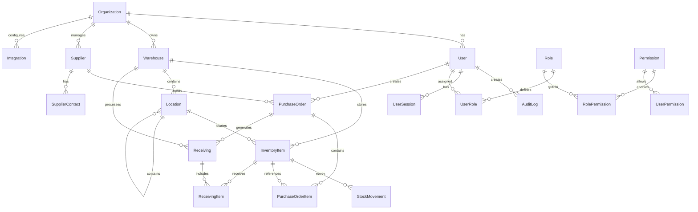

# Database Schema Documentation

## Overview

LogiVox uses PostgreSQL with Prisma ORM for database management. The schema is designed to support multi-tenant SaaS architecture with robust inventory management, purchase order tracking, and ERP integrations.

## Entity Relationship Diagram



## Core Entities

### Organizations

Multi-tenant support with organization isolation.

```sql
Table: organizations
- id (String, Primary Key)
- name (String)
- slug (String, Unique)
- description (String, Optional)
- logo (String, Optional)
- website (String, Optional)
- industry (String, Optional)
- size (String, Optional)
- subscription_id (String, Optional, Foreign Key)
- is_active (Boolean, Default: true)
- created_at (DateTime)
- updated_at (DateTime)
```

**Key Features:**
- Unique slug for organization identification
- Optional branding (logo, website)
- Industry categorization for analytics
- Linked to subscription for billing

### Users

User management with role-based access control.

```sql
Table: users
- id (String, Primary Key)
- email (String, Unique)
- first_name (String)
- last_name (String)
- avatar (String, Optional)
- phone (String, Optional)
- organization_id (String, Foreign Key)
- role (Enum: ADMIN, MANAGER, USER, SUPPLIER)
- is_active (Boolean, Default: true)
- created_at (DateTime)
- updated_at (DateTime)
```

**Relationships:**
- Belongs to one Organization
- Has many UserRoles (many-to-many with Roles)
- Has many UserPermissions (direct permissions)
- Creates AuditLogs, PurchaseOrders, etc.

### Warehouses

Physical warehouse locations for inventory storage.

```sql
Table: warehouses
- id (String, Primary Key)
- name (String)
- code (String, Unique)
- description (String, Optional)
- address (JSON, Optional)
- location (JSON, Optional) -- GPS coordinates
- organization_id (String, Foreign Key)
- created_by_id (String, Foreign Key)
- is_active (Boolean, Default: true)
- created_at (DateTime)
- updated_at (DateTime)
```

**Address JSON Structure:**
```json
{
  "street": "123 Industrial Ave",
  "city": "Manufacturing City",
  "state": "CA",
  "country": "USA",
  "postalCode": "12345"
}
```

**Location JSON Structure:**
```json
{
  "latitude": 37.7749,
  "longitude": -122.4194
}
```

### Locations

Hierarchical storage locations within warehouses (Aisle > Bay > Shelf > Bin).

```sql
Table: locations
- id (String, Primary Key)
- name (String) -- e.g., "A1-01-001"
- type (String) -- "aisle", "bay", "shelf", "bin"
- barcode (String, Optional, Unique)
- description (String, Optional)
- capacity (Integer, Optional)
- parent_id (String, Optional, Foreign Key)
- warehouse_id (String, Foreign Key)
- is_active (Boolean, Default: true)
- created_at (DateTime)
- updated_at (DateTime)
```

**Hierarchy Example:**
```
Warehouse: Main Warehouse
├── Aisle: A1
│   ├── Bay: A1-01
│   │   ├── Shelf: A1-01-001
│   │   └── Shelf: A1-01-002
│   └── Bay: A1-02
└── Aisle: A2
```

### Inventory Items

Core inventory management with detailed tracking.

```sql
Table: inventory_items
- id (String, Primary Key)
- sku (String) -- Stock Keeping Unit
- name (String)
- description (String, Optional)
- category (String, Optional)
- brand (String, Optional)
- unit_of_measure (String) -- "pieces", "kg", "liters"
- cost_price (Decimal, Optional)
- selling_price (Decimal, Optional)
- currency (String, Default: "USD")
- weight (Decimal, Optional)
- dimensions (JSON, Optional)
- quantity (Integer, Default: 0)
- reserved_quantity (Integer, Default: 0)
- available_quantity (Integer, Default: 0)
- reorder_level (Integer, Optional)
- max_stock_level (Integer, Optional)
- batch_number (String, Optional)
- serial_number (String, Optional)
- expiry_date (DateTime, Optional)
- status (Enum: ACTIVE, INACTIVE, DISCONTINUED, DAMAGED)
- warehouse_id (String, Foreign Key)
- location_id (String, Optional, Foreign Key)
- created_by_id (String, Foreign Key)
- is_active (Boolean, Default: true)
- created_at (DateTime)
- updated_at (DateTime)

UNIQUE CONSTRAINT: (sku, warehouse_id)
```

**Dimensions JSON Structure:**
```json
{
  "length": 10.5,
  "width": 8.0,
  "height": 3.2,
  "unit": "cm"
}
```

### Stock Movements

Audit trail for all inventory quantity changes.

```sql
Table: stock_movements
- id (String, Primary Key)
- type (Enum: INBOUND, OUTBOUND, ADJUSTMENT, TRANSFER, RETURN)
- quantity (Integer)
- reference (String, Optional) -- PO number, adjustment ref
- reason (String, Optional)
- notes (String, Optional)
- inventory_item_id (String, Foreign Key)
- created_at (DateTime)
```

### Suppliers

Supplier management with contact information.

```sql
Table: suppliers
- id (String, Primary Key)
- name (String)
- code (String, Unique)
- email (String, Optional)
- phone (String, Optional)
- website (String, Optional)
- address (JSON, Optional)
- tax_id (String, Optional)
- payment_terms (String, Optional) -- "Net 30", "COD"
- currency (String, Default: "USD")
- status (Enum: ACTIVE, INACTIVE, SUSPENDED, PENDING_APPROVAL)
- rating (Integer, Optional, 0-5)
- organization_id (String, Foreign Key)
- is_active (Boolean, Default: true)
- created_at (DateTime)
- updated_at (DateTime)
```

### Purchase Orders

Purchase order management with line items.

```sql
Table: purchase_orders
- id (String, Primary Key)
- number (String, Unique) -- Auto-generated: PO-2024-001
- status (Enum: DRAFT, PENDING_APPROVAL, APPROVED, SENT, CONFIRMED, 
          PARTIALLY_RECEIVED, RECEIVED, CANCELLED, CLOSED)
- order_date (DateTime)
- expected_date (DateTime, Optional)
- notes (String, Optional)
- subtotal (Decimal, Default: 0)
- tax_amount (Decimal, Default: 0)
- total_amount (Decimal, Default: 0)
- currency (String, Default: "USD")
- supplier_id (String, Foreign Key)
- created_by_id (String, Foreign Key)
- is_active (Boolean, Default: true)
- created_at (DateTime)
- updated_at (DateTime)
```

### Purchase Order Items

Line items within purchase orders.

```sql
Table: purchase_order_items
- id (String, Primary Key)
- quantity (Integer)
- unit_price (Decimal)
- total_price (Decimal)
- description (String, Optional)
- received_quantity (Integer, Default: 0)
- purchase_order_id (String, Foreign Key)
- inventory_item_id (String, Optional, Foreign Key)
- created_at (DateTime)
- updated_at (DateTime)
```

### Receiving

Stock receiving/booking process with quality control.

```sql
Table: receivings
- id (String, Primary Key)
- number (String, Unique) -- Auto-generated: REC-2024-001
- status (Enum: PENDING, IN_PROGRESS, COMPLETED, DISCREPANCY, CANCELLED)
- received_date (DateTime, Optional)
- notes (String, Optional)
- photos (JSON, Optional) -- Array of photo URLs
- damages (JSON, Optional) -- Damage reports
- purchase_order_id (String, Optional, Foreign Key)
- warehouse_id (String, Foreign Key)
- created_at (DateTime)
- updated_at (DateTime)
```

### Receiving Items

Individual items received with quality information.

```sql
Table: receiving_items
- id (String, Primary Key)
- expected_quantity (Integer)
- received_quantity (Integer)
- damaged_quantity (Integer, Default: 0)
- batch_number (String, Optional)
- expiry_date (DateTime, Optional)
- condition (String, Optional) -- "good", "damaged", "expired"
- notes (String, Optional)
- receiving_id (String, Foreign Key)
- purchase_order_item_id (String, Optional, Foreign Key)
- inventory_item_id (String, Foreign Key)
- created_at (DateTime)
- updated_at (DateTime)
```

## Role-Based Access Control (RBAC)

### Roles

Predefined roles with specific permissions.

```sql
Table: roles
- id (String, Primary Key)
- name (String, Unique) -- "admin", "manager", "user", "supplier"
- description (String, Optional)
- is_default (Boolean, Default: false)
- created_at (DateTime)
- updated_at (DateTime)
```

### Permissions

Granular permissions for system features.

```sql
Table: permissions
- id (String, Primary Key)
- name (String, Unique) -- "warehouse:create", "inventory:read"
- description (String, Optional)
- module (String) -- "warehouse", "inventory", "reports"
- action (String) -- "create", "read", "update", "delete"
- created_at (DateTime)
```

### User Roles & Permissions

Many-to-many relationships for flexible access control.

```sql
Table: user_roles
- id (String, Primary Key)
- user_id (String, Foreign Key)
- role_id (String, Foreign Key)
UNIQUE CONSTRAINT: (user_id, role_id)

Table: role_permissions
- id (String, Primary Key)
- role_id (String, Foreign Key)
- permission_id (String, Foreign Key)
UNIQUE CONSTRAINT: (role_id, permission_id)

Table: user_permissions
- id (String, Primary Key)
- user_id (String, Foreign Key)
- permission_id (String, Foreign Key)
UNIQUE CONSTRAINT: (user_id, permission_id)
```

## ERP Integrations

### Integrations

Configuration for external system connections.

```sql
Table: integrations
- id (String, Primary Key)
- name (String) -- "Oracle", "SAP", "NetSuite"
- type (String) -- "ERP", "WMS", "Accounting"
- status (Enum: ACTIVE, INACTIVE, ERROR, PENDING)
- config (JSON) -- Connection details, API keys
- last_sync_at (DateTime, Optional)
- sync_frequency (String, Optional) -- "hourly", "daily"
- organization_id (String, Foreign Key)
- is_active (Boolean, Default: true)
- created_at (DateTime)
- updated_at (DateTime)
```

**Config JSON Example:**
```json
{
  "apiUrl": "https://your-oracle.com/api",
  "apiKey": "encrypted_key",
  "username": "integration_user",
  "mappings": {
    "warehouse": "INV_ORG_ID",
    "supplier": "VENDOR_ID",
    "item": "ITEM_ID"
  }
}
```

### Integration Sync Logs

Audit trail for integration synchronization.

```sql
Table: integration_sync_logs
- id (String, Primary Key)
- status (String) -- "success", "error", "warning"
- message (String, Optional)
- details (JSON, Optional) -- Error details, sync statistics
- started_at (DateTime)
- completed_at (DateTime, Optional)
- integration_id (String, Foreign Key)
```

## Subscription & Billing

### Subscriptions

SaaS subscription management.

```sql
Table: subscriptions
- id (String, Primary Key)
- plan (String) -- "starter", "pro", "enterprise"
- status (Enum: ACTIVE, CANCELLED, PAST_DUE, UNPAID, TRIALING)
- amount (Decimal)
- currency (String, Default: "USD")
- interval (String) -- "monthly", "yearly"
- start_date (DateTime)
- end_date (DateTime, Optional)
- trial_ends (DateTime, Optional)
- stripe_customer_id (String, Optional)
- stripe_subscription_id (String, Optional)
- created_at (DateTime)
- updated_at (DateTime)
```

## Audit & Compliance

### Audit Logs

Complete audit trail for all system actions.

```sql
Table: audit_logs
- id (String, Primary Key)
- action (String) -- "create", "update", "delete", "login"
- entity (String) -- "user", "warehouse", "inventory"
- entity_id (String, Optional)
- old_values (JSON, Optional)
- new_values (JSON, Optional)
- ip_address (String, Optional)
- user_agent (String, Optional)
- user_id (String, Optional, Foreign Key)
- organization_id (String, Optional, Foreign Key)
- created_at (DateTime)
```

### User Sessions

Session management for authentication.

```sql
Table: user_sessions
- id (String, Primary Key)
- token (String, Unique)
- refresh_token (String, Optional, Unique)
- ip_address (String, Optional)
- user_agent (String, Optional)
- expires_at (DateTime)
- user_id (String, Foreign Key)
- is_active (Boolean, Default: true)
- created_at (DateTime)
```

## Indexes

Key database indexes for performance:

```sql
-- User indexes
CREATE INDEX idx_users_email ON users(email);
CREATE INDEX idx_users_organization ON users(organization_id);

-- Inventory indexes
CREATE INDEX idx_inventory_sku ON inventory_items(sku);
CREATE INDEX idx_inventory_warehouse ON inventory_items(warehouse_id);
CREATE INDEX idx_inventory_category ON inventory_items(category);
CREATE INDEX idx_inventory_status ON inventory_items(status);

-- Purchase order indexes
CREATE INDEX idx_po_number ON purchase_orders(number);
CREATE INDEX idx_po_supplier ON purchase_orders(supplier_id);
CREATE INDEX idx_po_status ON purchase_orders(status);
CREATE INDEX idx_po_dates ON purchase_orders(order_date, expected_date);

-- Stock movement indexes
CREATE INDEX idx_movements_item ON stock_movements(inventory_item_id);
CREATE INDEX idx_movements_date ON stock_movements(created_at);

-- Audit log indexes
CREATE INDEX idx_audit_entity ON audit_logs(entity, entity_id);
CREATE INDEX idx_audit_user ON audit_logs(user_id);
CREATE INDEX idx_audit_date ON audit_logs(created_at);
```

## Data Migration

### From Excel/CSV

Common migration scenarios and field mappings:

```sql
-- Inventory migration mapping
INSERT INTO inventory_items (
  sku, name, description, category, quantity, cost_price, warehouse_id
) 
SELECT 
  UPPER(TRIM(excel_sku)),
  TRIM(excel_name),
  TRIM(excel_description),
  COALESCE(TRIM(excel_category), 'Uncategorized'),
  COALESCE(excel_quantity::integer, 0),
  COALESCE(excel_cost::decimal, 0),
  (SELECT id FROM warehouses WHERE code = 'DEFAULT')
FROM imported_excel_data;
```

## Backup & Recovery

### Backup Strategy

```bash
# Full database backup
pg_dump flowstock > backup_$(date +%Y%m%d_%H%M%S).sql

# Schema only backup
pg_dump --schema-only flowstock > schema_backup.sql

# Data only backup
pg_dump --data-only flowstock > data_backup.sql
```

### Point-in-Time Recovery

PostgreSQL WAL archiving for point-in-time recovery:

```bash
# Enable WAL archiving in postgresql.conf
wal_level = replica
archive_mode = on
archive_command = 'cp %p /path/to/archive/%f'
```

## Performance Optimization

### Query Optimization

1. **Use appropriate indexes** for frequently queried columns
2. **Partition large tables** by date or organization
3. **Use materialized views** for complex analytics
4. **Implement connection pooling** with PgBouncer

### Monitoring

Key metrics to monitor:

- Database connection count
- Query execution times
- Index usage statistics
- Table sizes and growth
- Replication lag (if applicable)

## Security Considerations

1. **Row-level security** for multi-tenant isolation
2. **Encrypted sensitive data** (API keys, payment info)
3. **Regular security audits** of permissions
4. **Database user privileges** following least privilege principle
5. **SSL/TLS connections** for all database communications