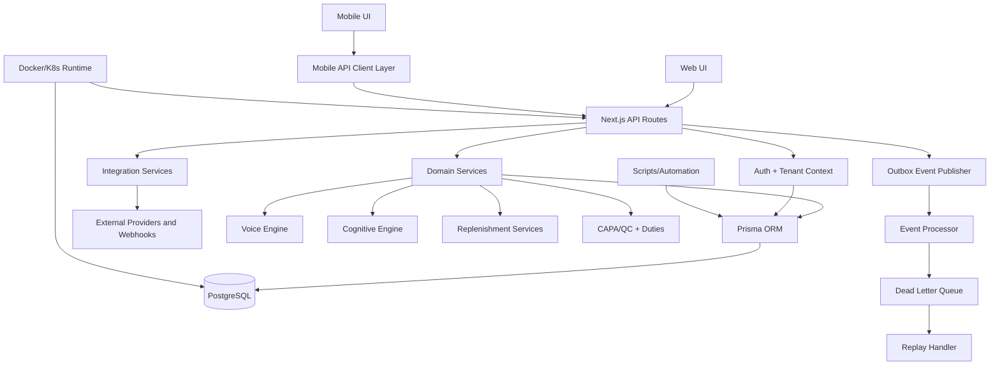

# LogiVox Consolidated Architecture and Codebase Plan

Date: 2026-06-16
Repository: HorizonCore-Solutions-Ltd/Logivox
Branch: main

## 1) Full Architecture Overview

### 1.1 System Shape
LogiVox is a modular monolith in a monorepo, centered on a unified Next.js web application with an Expo mobile client, Prisma/PostgreSQL persistence, and infrastructure deployment assets for Docker and Kubernetes.

### 1.2 Architectural Layers
1. Experience Layer
- Web app pages and dashboards in apps/web/src/app
- Mobile app tabs/workflows in apps/mobile/app

2. API/Application Layer
- Route handlers in apps/web/src/app/api grouped by domain capability (inventory, orders, replenishment, CAPA/QC, yard, dock, voice, integrations, etc.)

3. Domain Services Layer
- Operational and business orchestration in apps/web/src/lib/services
- Voice engine in apps/web/src/lib/voice
- Cognitive engine in apps/web/src/lib/cognitive

4. Data Layer
- Prisma schema and migrations in prisma
- PostgreSQL as primary data store

5. Integration and Event Layer
- Webhook handling and delivery logs
- Outbox event publish/process and dead-letter replay utilities in lib
- Time and attendance provider adapters

6. Platform and Ops Layer
- Dockerfile, docker-compose, docker-compose.prod
- Kubernetes manifests in k8s
- Utility scripts in scripts

### 1.3 Core Non-Functional Controls
1. Authentication and authorization (NextAuth + role checks)
2. Tenant scoping patterns (organizationId in queries)
3. Security middleware with headers and defensive checks
4. Event reliability primitives (idempotency, outbox, DLQ)
5. Health/readiness endpoints and deploy probes

---

## 2) Domain Map

1. Identity and Tenant Domain
- Users, org memberships, sessions, roles, auth events

2. WMS Execution Domain
- Inventory, locations, receiving, picking, packing, shipments, transfers, waves

3. Replenishment Domain
- Min/max and reorder rule execution, task generation, IoT-triggered replenishment

4. Quality and CAPA Domain
- NCR, CAPA, root cause, supplier quality, quality holds, verification and reporting

5. Duties and Workforce Domain
- Duty planning/assignment/evidence, shift and time-entry relations

6. Yard, Dock, Gate, Security Ops Domain
- Gate entries, dock appointments, yard movement, security event models

7. Voice and Cognitive Domain
- Voice intent/session processing, event-driven decision-cycle governors

8. Integration Domain
- Webhooks, integration mappings/sync/logging, time-attendance adapters

9. Analytics and Reporting Domain
- KPIs, dashboards, scheduled/exported reports, analytics events

10. Sustainability and Operational Governance Domain
- Sustainability model surface, compliance and operational policy/reporting support

---

## 3) Module Map

### 3.1 Primary Runtime Modules
1. Web Module: apps/web
- UI routes, API routes, middleware, domain services

2. Mobile Module: apps/mobile
- Native workflows, API clients, offline queue/sync, voice capture

3. Data Module: prisma
- Canonical relational model + migrations + seed scripts

4. Cross-Cutting Backend Utilities: lib
- Event service, DLQ, idempotency, API middleware, security helpers

### 3.2 Web Submodule Map (apps/web/src)
1. app/(dashboard): operational work surfaces
2. app/(auth): auth flows
3. app/(marketing): public site and content
4. app/api: REST capability surface
5. components: feature UI components by domain
6. lib/services: domain orchestration and business rules
7. lib/voice: command parsing/session logic
8. lib/cognitive: decision-cycle orchestration/governors
9. lib/reports, lib/integrations, lib/logistics, lib/simulation

### 3.3 Mobile Submodule Map (apps/mobile/lib)
1. api: backend endpoint clients by domain
2. hooks: auth and voice hooks
3. store: auth/addons/offline sync stores
4. config: role/addon configuration

---

## 4) Dependency Graph

### 4.1 Key Internal Dependencies
1. apps/web depends on prisma schema and root lib utilities
2. apps/mobile depends on API contract consistency from apps/web
3. CAPA and QC services depend on correctivePreventiveAction and related quality models
4. Duty service depends on duty, dutyType, employee/shift relationships
5. Event flows depend on outbox and dead-letter tables/models

---

## 5) Workflow Summary

1. Inbound Workflow
- Receiving/API intake -> quality risk routing -> putaway/cross-dock recommendation -> task generation

2. Outbound Workflow
- Sales order lifecycle -> pick task creation/execution -> packing -> shipment/tracking and status updates

3. Replenishment Workflow
- Rule evaluation -> pick-face shortage detection -> reserve source lookup -> replenishment task orchestration
- Optional IoT trigger ingestion can auto-create tasks

4. Quality/CAPA Workflow
- Issue/NCR capture -> CAPA creation -> staged progression (containment/root cause/corrective/preventive/verification)
- CAPA stages can emit duty records for execution and evidence

5. Yard/Gate/Dock Workflow
- Check-in and gate events -> dock and yard coordination -> status and operational traceability

6. Voice Workflow
- Session start -> speech/text parse -> intent execution -> session interaction persistence

7. Mobile Offline Workflow
- Enqueue operation while offline -> reconnect -> replay queue -> synchronize server changes

8. Cognitive Workflow
- Trigger event -> governor proposals -> confidence filtering -> execution + decision log persistence

---

## 6) Current Capability Inventory (Comprehensive)

### 6.1 Core WMS
1. Multi-warehouse inventory and location management
2. Receiving and GRN progression
3. Picking tasks and wave-linked execution
4. Packing/package/shipment flow support
5. Stock adjustments and warehouse transfers
6. Cycle counts and operational inventory controls

### 6.2 Replenishment and Optimization
1. Replenishment rules and task generation
2. Manual and automatic replenishment run endpoints
3. IoT-triggered replenishment ingestion
4. Slotting/load-related service surfaces
5. Simulation endpoints for operational scenarios

### 6.3 Quality and CAPA
1. CAPA create/list/update domain endpoints
2. Quality inspections/templates/holds/reporting endpoints
3. Root-cause and supplier-quality service components
4. CAPA-to-duty bridge for staged operational follow-through

### 6.4 Duties and Workforce
1. Duty CRUD and planning endpoints
2. Auto-assignment logic using skills/certs/zone preference
3. SLA breach tracking support
4. Time-entry and attendance integration points

### 6.5 Yard, Gate, Dock, Security
1. Gate entries and yard movement endpoints
2. Dock appointment and status APIs
3. Security-related schema surface for incidents/access/alerts

### 6.6 Voice and Cognitive
1. Voice processing endpoint and server-side engine
2. Voice session persistence models
3. Cognitive decision-cycle API and governor framework

### 6.7 Integrations and Webhooks
1. Webhook config endpoints
2. Webhook delivery execution and logging
3. Time-attendance provider abstraction and webhook ingest
4. Integration mappings, sync logs, and connection models

### 6.8 Reporting, Analytics, and Portals
1. Reports lifecycle endpoints (generate/execute/download)
2. KPI and analytics endpoints
3. Customer/supplier/carrier portal endpoints

### 6.9 Platform and Ops
1. Health/live/ready and DB checks
2. Docker and Kubernetes deployment assets
3. Backup/restore/setup and validation scripts
4. E2E suites for smoke/security/inventory/production validation

---

## 7) Codebase Health Assessment

Important: no editor-level diagnostics were returned by the language service at scan time, but source inspection shows architectural and implementation risks that should be fixed.

### 7.1 Confirmed Risks / Issues

1. Endpoint contract drift between mobile and web voice APIs
- Mobile client expects /api/voice/transcribe and /api/voice/command
- Web currently implements a consolidated /api/voice route
- Risk: mobile voice workflow breaks or requires hidden compatibility layer

2. Duplicate imports / repeated blocks in some API files
- Example patterns seen in gate-entry and picking-task route files (repeated imports/definitions)
- Risk: maintainability degradation and potential accidental logic divergence

3. Mixed maturity of endpoints
- Some routes are production-grade, others still include mock/default placeholders
- Risk: inconsistent behavior in real production workflows

4. Webhook model naming inconsistency risk
- Webhook API route and webhook service use different model naming patterns (webhook vs integrationWebhook)
- Risk: runtime mismatch and confusion in ownership of webhook records

5. Tenant-scoping hardening is partially implemented, not universal
- Strong intent exists, but enforcement style varies route to route
- Risk: accidental cross-tenant query/write exposure in future changes

6. Docs and implementation drift possibility
- Documentation footprint is very large and comprehensive; implementation changes can outpace docs updates
- Risk: operational misunderstanding and onboarding friction

### 7.2 CAPA-Specific Health
- CAPA is integrated into quality workflows and connected to duties.
- CAPA is not an isolated bolt-on; it participates in broader compliance/operations execution.
- Removing CAPA would break a meaningful part of the quality and operational governance value proposition.

---

## 8) Recommendation: Remove CAPA or Keep It?

Recommendation: KEEP CAPA.

Rationale:
1. CAPA is deeply wired into quality and duties workflows.
2. CAPA is a key enterprise differentiator for compliance-heavy customers.
3. Removing CAPA now would reduce system coherence more than it would reduce complexity.
4. Complexity should be managed through hardening and modular boundaries, not domain removal.

Alternative only if absolutely needed:
- If product strategy narrows to a lightweight SMB WMS, CAPA can be feature-flagged, not removed.

---

## 9) Plan to Complete and Correct the Codebase

### Phase 1: Contract and Reliability Stabilization (1-2 weeks)
1. Normalize voice API contracts
- Implement compatibility endpoints (/api/voice/transcribe and /api/voice/command) or update mobile client to canonical /api/voice behavior.

2. Remove duplicate imports/duplicate definitions in affected API routes
- Gate entries and picking task routes first.

3. Unify webhook model usage
- Decide one canonical model path and refactor route/service usage consistently.

4. Add endpoint contract tests for voice, mobile sync, and webhooks
- Prevent future drift.

Deliverable: mobile/web contract parity and event/webhook reliability baseline.

### Phase 2: Tenant and Security Hardening (1-2 weeks)
1. Enforce tenant guards consistently for all mutating/list routes
2. Add route-level authorization matrix tests per domain
3. Validate audit logging on high-risk operations (stock, task, CAPA, gate, webhook)

Deliverable: consistent multi-tenant safety and auditability.

### Phase 3: Domain Maturity Alignment (2-4 weeks)
1. Identify mock/placeholder endpoints and replace with real service logic
2. Standardize domain service patterns and error envelopes
3. Promote common orchestration primitives (validation, auth, idempotency, eventing) to shared middleware/service utilities

Deliverable: reduced behavior variance across modules.

### Phase 4: Maintainability and Operability (ongoing)
1. Add architecture decision records for key domains (voice, CAPA, replenishment, events)
2. Set documentation update gates in CI for changed domains
3. Add module-level ownership and lifecycle status tagging
4. Expand integration and load/security test gates for release

Deliverable: sustainable maintenance process.

---

## 10) Final Decision Guidance

1. Is the codebase fine as-is?
- Not fully. It is feature-rich and structurally strong, but it needs targeted hardening for consistency and maintainability.

2. Should CAPA be removed?
- No. Keep CAPA and stabilize around it.

3. Is it maintainable if kept as-is with no changes?
- Risky. It should be kept, but with the remediation phases above to ensure long-term maintainability.

---

## 11) Downloadable Artifacts Produced

1. This full report (Markdown):
- docs/status-reports/CONSOLIDATED_ARCHITECTURE_AND_CODEBASE_PLAN_2026-06-16.md

2. PDF export (generated from this report):
- docs/status-reports/CONSOLIDATED_ARCHITECTURE_AND_CODEBASE_PLAN_2026-06-16.pdf
